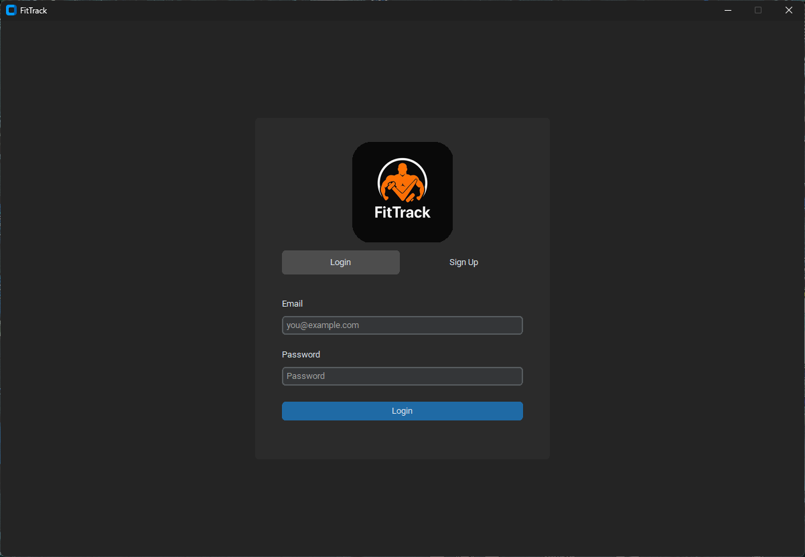
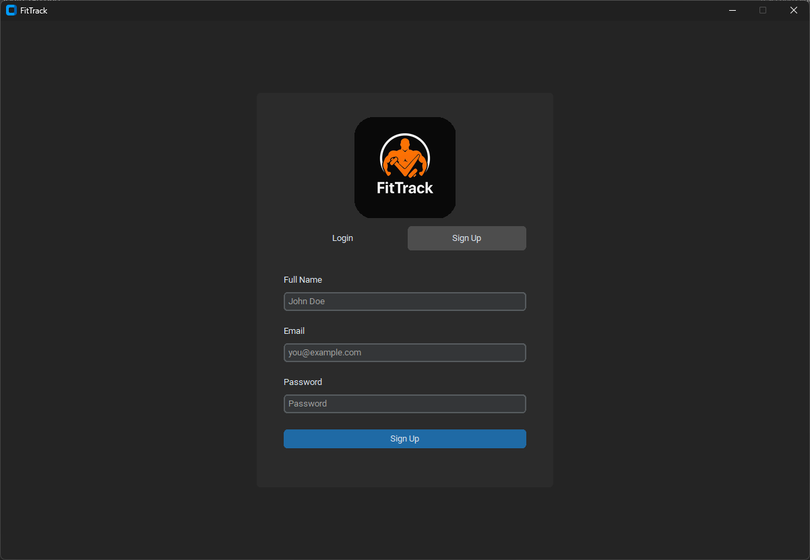
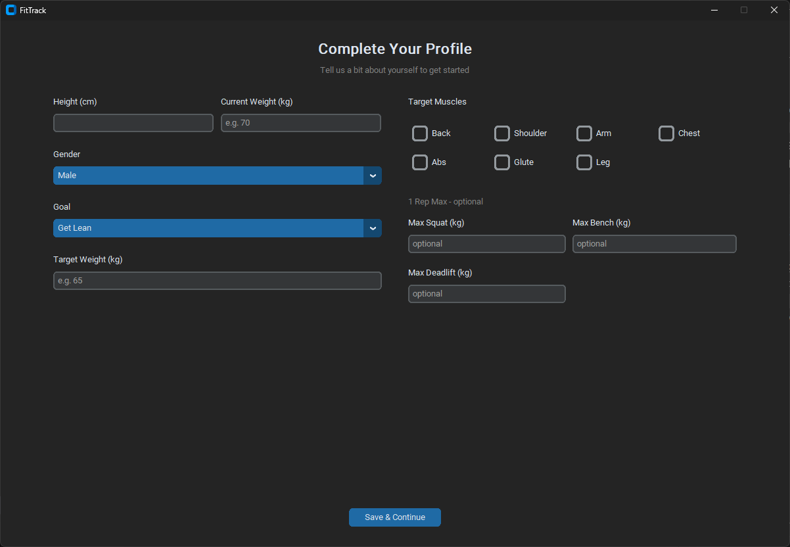
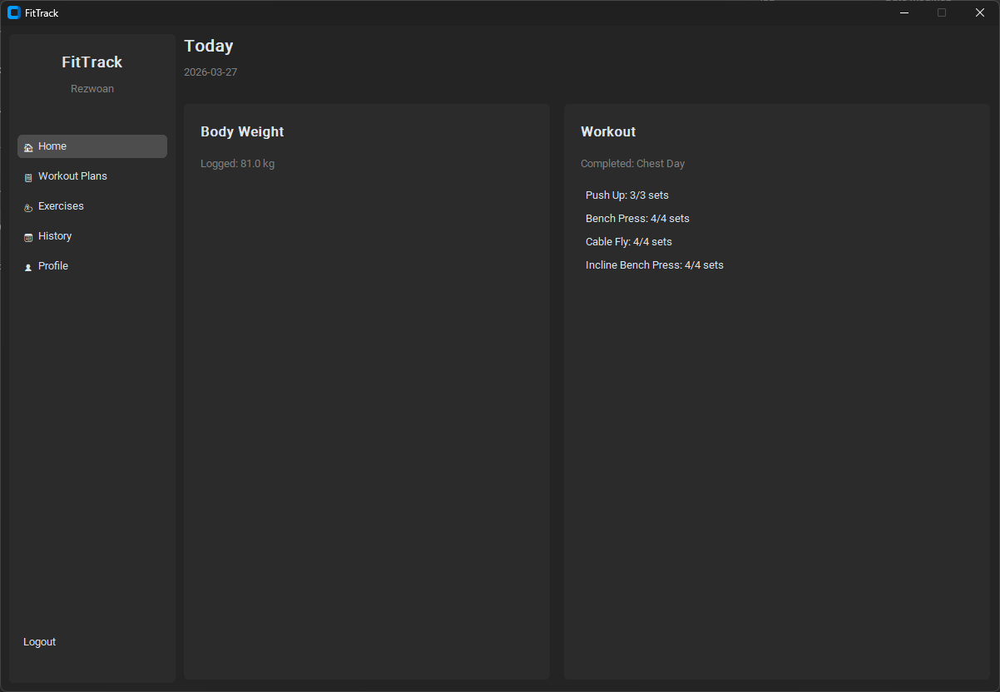
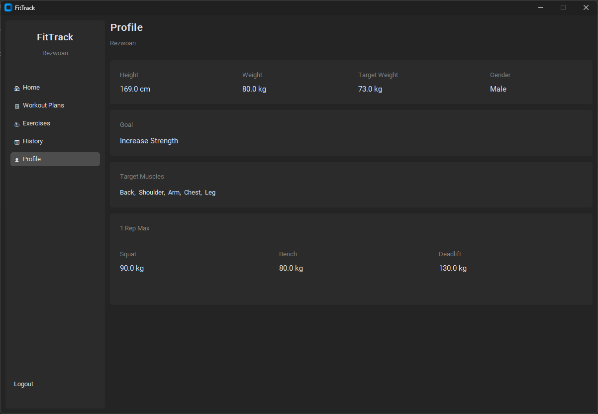
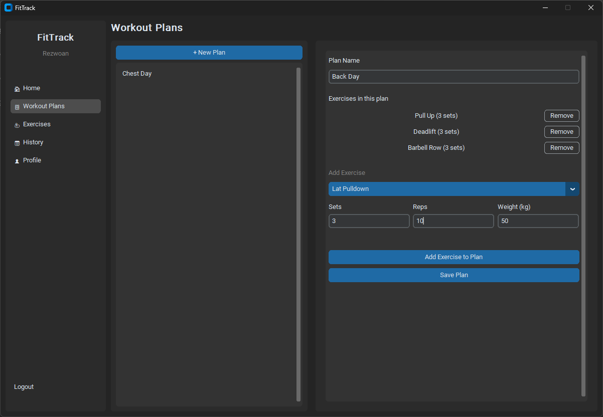
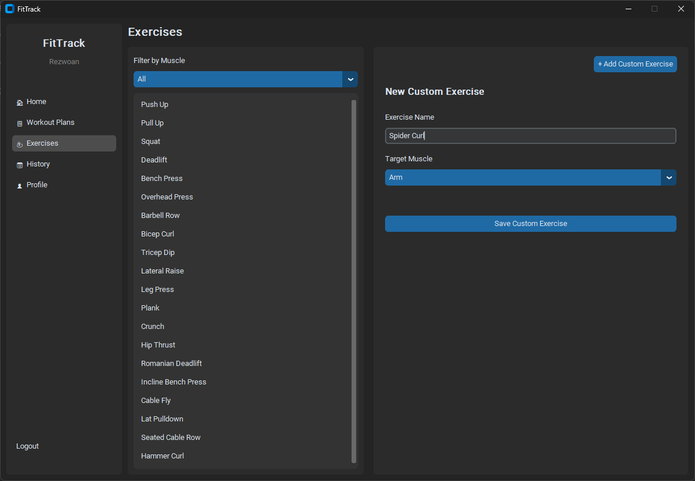
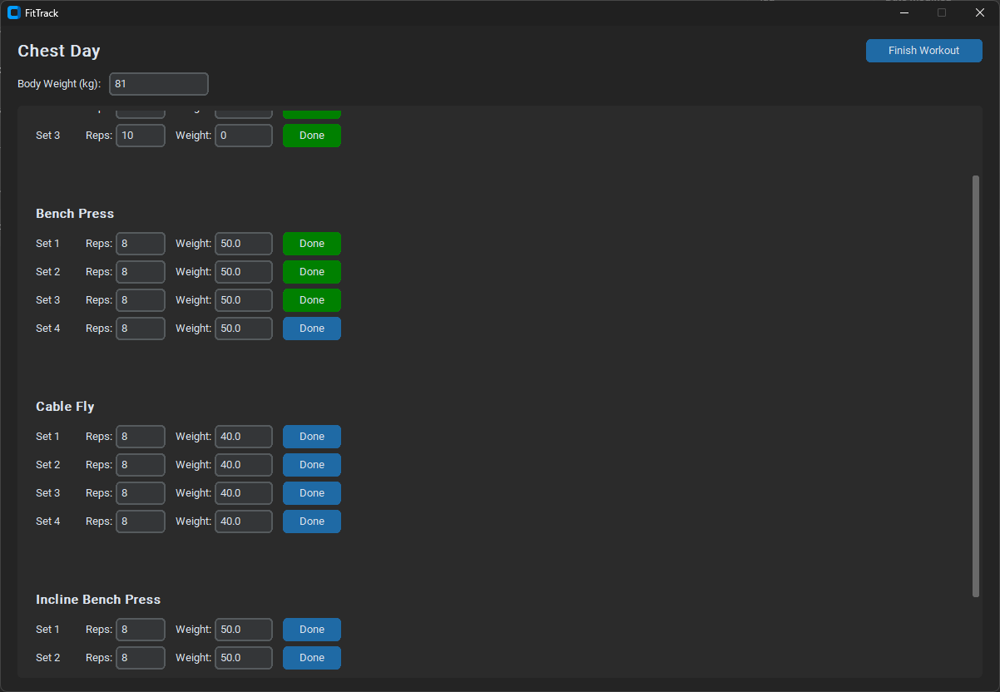

# FitTrack: Desktop Gym Workout Tracker

This is my Mid-Term Project for **Programming in Python** (Section B, Spring 2025-26). It's a desktop app built using Python and `customtkinter` to track gym workouts, build routines, and keep a log of your progress. All user data is saved locally using JSON files, keeping things simple and standalone.

**Student:** Din Muhammad Rezwoan (ID: 23-51712-2)  
**Instructor:** MD. Tanzeem Rahat  

## Features
- **User Authentication:** Sign up with a name, email, and password. I used `bcrypt` to hash the passwords before saving them so plain text isn't stored.
- **First-Time Profile Setup:** New users are prompted to fill out their fitness profile (height, weight, gender, target weight, fitness goals, preferred muscles, and optional 1-rep maxes for squat, bench, and deadlift).
- **Exercise Library:** Comes with a built-in list of common gym exercises. Users can also add their own custom exercises if something is missing.
- **Workout Plan Builder:** Create and name custom workout plans. Add exercises to them, setting the number of sets, target reps, and weights.
- **Active Workout Session:** Start a session from your saved plans. Tick off sets as you complete them, and easily adjust the reps or weight on the spot if they differ from the plan.
- **Workout History:** Once done, past sessions are saved. You can view full details of what was done that day in the history screen.
- **Body Weight Tracker:** Log your body weight directly from the dashboard to make sure you're on track.

## How to Setup and Run
Make sure you have Python 3 installed, then follow these steps:

1. Clone the repository:
   ```bash
   git clone https://github.com/Rezwoan/FitTrack.git
   ```
2. Move into the project folder:
   ```bash
   cd FitTrack
   ```
3. Install the required libraries (`customtkinter`, `bcrypt`, and `Pillow`):
   ```bash
   pip install -r requirements.txt
   ```
4. Run the app:
   ```bash
   python main.py
   ```

## Screenshots

<p align="center">
  <b>Authentication & Profile Setup</b><br>
  
  
  
</p>

<p align="center">
  <b>Dashboard & Profile</b><br>
  
  
</p>

<p align="center">
  <b>Workouts & Exercises</b><br>
  
  
</p>

<p align="center">
  <b>Active Workout Session</b><br>
  
</p>
